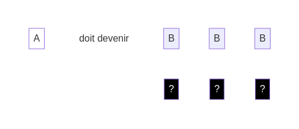

## Comment jouer ?

Chaque **défi** te montre une ligne de **dés blancs** comme point de départ et un objectif à atteindre. Voici un exemple de **défi** :

Tu dois activer chaque **dé blanc** en plaçant un **dé noir** dessous :

Important : un **dé noir** va déclencher un effet avant l'activation du **dé blanc**.

L'effet dépend de la face choisie pour le **dé noir**.

### Règles des **dés noirs** :

* Un **dé noir** est placé sous le **dé blanc** qu'il active.
* Les **dés blancs** sont activés un par un dans l'ordre de la ligne.
* Pour chaque **dé noir**, tu dois utiliser un effet différent du précédent.
* Une fois un **dé noir** posé et son effet résolu, le **dé blanc** est activé et ne peux plus être modifié.

Chaque face des **dés noirs** a une fonction spécifique. Voici les deux premières :

* Ajouter : Décale le **dé blanc** et les dés suivants d'une position vers la droite, et ajoute un nouveau **dé blanc**.
* Tourner : Change la face du **dé blanc**.

[suivant](./2)
[retour](./)
