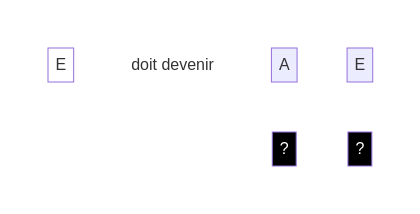

## Comment jouer ?

Chaque **défi** commence avec des **dés blancs**. Ton objectif est de les transformer pour atteindre la solution demandée. Voici comment ça fonctionne :

Les **dés noirs** sont utilisés pour changer les **dés blancs**. Place un **dé noir** sous chaque dé blanc pour :

1. **Modifier** : Le **dé noir** change le **dé blanc** au-dessus de lui.
2. **Activer** : Une fois modifié, le **dé blanc** est activé et ne peut plus être changé.

### Règles des **dés noirs**

1. **Un dé noir par dé blanc** : Utilise un **dé noir** pour chaque **dé blanc** de la solution.
2. **Place dans l'ordre** : Place les **dés noirs** de gauche à droite. Applique l'effet du **dé noir** avant de placer le suivant.
3. **Ne te répète pas** : Tu peux utiliser un effet plusieurs fois dans un **défi**, mais pas 2 fois de suite. Chaque **dé noir** doit avoir un effet différent du précédent.

### Effets des dés noirs

Voici les deux premiers effets des **dés noirs** :

- "A" - Ajouter : Ajoute un nouveau **dé blanc** avec la face de ton choix. Si besoin, décale les **dés blancs** pour faire de la place.
- "T" - Tourner : Change la face du **dé blanc**. Le dé doit changer de face.

[retour](./)

[suivant](./2)

