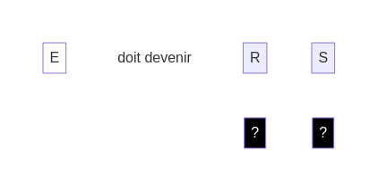
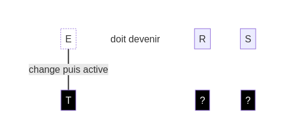

## Comment jouer ?

Chaque **défi** te montre une ligne de **dés blancs** comme point de départ et un objectif à atteindre. Voici un exemple de **défi** :

Tu dois activer chaque **dé blanc** en plaçant un **dé noir** dessous :

Chaque **dé noir** change son **dé blanc** avant de l'activer. Le changement dépend de la face du **dé noir**.

### Règles des **dés noirs** :

1. Un **dé noir** par **dé blanc** : Utilise un **dé noir** pour chaque **dé blanc** de l'objectif.
2. Placement : Place les **dés noirs** de gauche à droite. Applique l'effet du **dé noir** avant de placer le suivant.
3. Effets des **dés noirs** : Chaque **dé noir** déclenche un effet sur le **dé blanc** au dessus de lui.
4. Effets différents : Pour chaque **dé noir**, utilise un effet différent du dé précédent.
5. Activation : Une fois le **dé noir** placé et son effet appliqué, le **dé blanc** est activé et ne peut plus être changé.

### Effets des dés noirs

Voici les deux premiers effets des **dés noirs** :

- "A" - Ajouter : Déplace le **dé blanc** une position vers la droite et ajoute un nouveau **dé blanc** à la place avec la face de ton choix.
- "T" - Tourner : Change la face du **dé blanc**.

[retour](./)

[suivant](./2)

