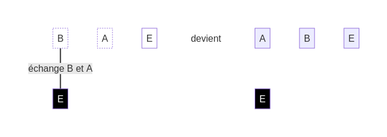

## Nouvelle action : Échanger

* "E" - Échanger : Échange le **dé blanc** avec le dé à sa droite.

Dans cet exemple de **défi**, l'action "E" - Échanger te permet d'intervertir les deux **dés blancs** "B" et "A" :

Cette nouvelle action te sera peut-être utile dans les **défis** à venir :

Coming soon

[retour](./9)

[suivant](./11)

