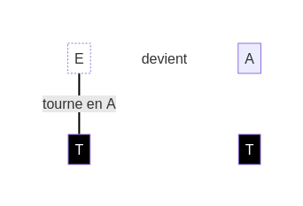
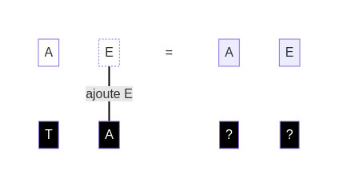

## Exemple

Regardons ensemble une première situation. La page suivante détaille la solution, mais tu peux essayer de la trouver toi-même :

Indice : l'objectif contient 2 **dés blancs**, donc tu dois utiliser 2 **dés noirs**.

Maintenant, à toi de résoudre ce **défi** :

Chaque **défi** n'a qu'une solution.

Solution

1. Tu dois obtenir un "A" pour le premier **dé blanc**. Utilise la face "T" - Tourner pour changer "E" en "A" :

    

2. Maintenant, tu as besoin d'un "E" pour le deuxième **dé blanc**. Utilise la face "A" - Ajouter pour ajouter un nouveau **dé blanc** avec la face "E" :

    

Chaque **dé blanc** est activé avec la bonne face : le **défi** est réussi !

[retour](./1)

[suivant](./3)

