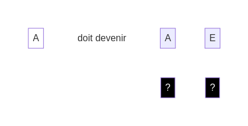
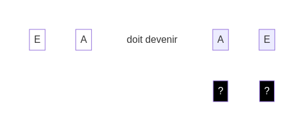

## Exemple

Supposons que tu aies le défi suivant :

Place un **dé noir** avec la face "Tourner" sous le **dé blanc** "E". Cela te permet de changer "E" en "A" :

Place un deuxième **dé noir** avec la face "Ajouter". Cela te permet d'ajouter un nouveau **dé blanc** avec la face "E" :

Chaque **dé blanc** est activé avec la bonne face : le **défi** est réussi !

[suivant](./3)
[retour](./1)
