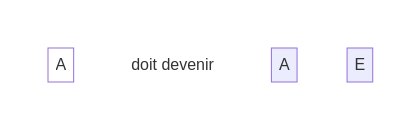
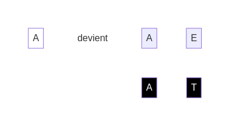

## Le savais-tu ?

Chaque face des **dés blancs** représente un élément de code.

Nous avons déjà vu :

* "A" - Afficher : Instruction qui permet de montrer un message à l'écran.
* "E" - Expression : Valeur ou opération qui produit une valeur. Exemple : `5 + 3`.

Le **pseudo-code** est une manière simplifiée de représenter ces éléments. Il utilise des mots-clés plus familiers que du "vrai" code :

    afficher(expression)

Par exemple : `afficher("Hello, World!")` ou `afficher(2 + 2)`

## Essaie de résoudre ce premier **défi**

Chaque **défi** n'a qu'une solution. Tu trouveras les solutions à la fin de ce livret.

Solution

[suivant](./4)
[retour](./2)
