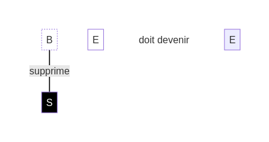
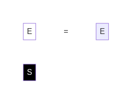
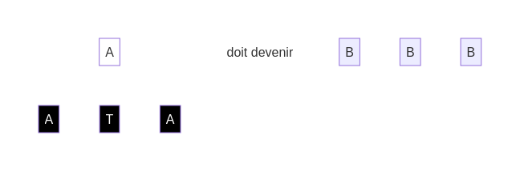
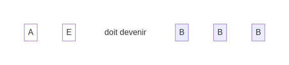
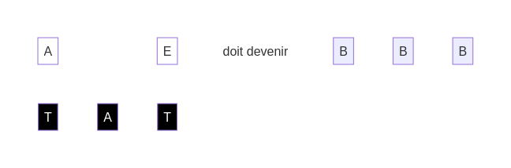

## Plus de défis

Nouvelle action :

* "S" - Supprimer : Retire le **dé blanc** et décale les dés suivants d'une position vers la gauche pour combler l'espace vide.

Par exemple, dans cette situation :

L'action "S" - Supprimer te permet de retirer le premier **dé blanc** :

Et le **dé blanc** "E" est décalé pour combler l'espace vide :

Tu vas pouvoir tester cette action dans les prochains défis :

Solution

Solution

[suivant](./5)
[retour](./3)
