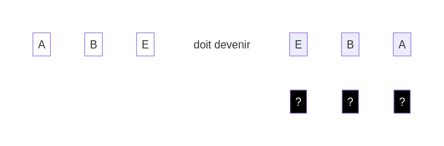
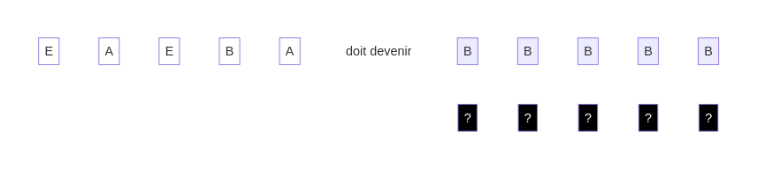

## Plus de défis

Nouvelle action :

* Supprimer : Retire le **dé blanc** et décale les dés suivants d'une position vers la gauche pour combler l'espace vide.

Solution

Solution

Nouvelle action :

* Échanger : Échange le **dé blanc** avec le dé à sa droite.

Solution

Solution

[suivant](./5)
[retour](./3)
