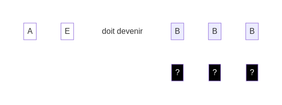

## Le savais-tu ?

Chaque face des **dés blancs** représente un élément de code.

En voici quelques unes :

* "A" - Afficher : Instruction qui permet de montrer un message à l'écran.
* "E" - Expression : Valeur ou opération qui produit une valeur. Exemple : `5 + 3`.
* "B" - Bug : Erreur de code qui fait échouer les programmes.

Ensemble, les **dés blancs** symbolisent du **pseudo-code** : c'est une manière simplifiée de représenter du code avec des mots-clés plus familiers que du "vrai" code :

    afficher(expression)

Par exemple : `afficher("Hello, World!")` ou `afficher(2 + 2)`

Les bugs ont une mauvaise réputation, mais t'apprendront beaucoup de choses.

Solution

Solution

[retour](./3)

[suivant](./5)

