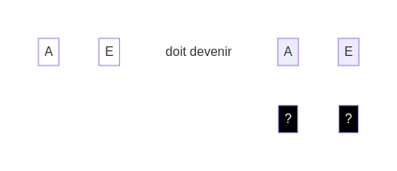
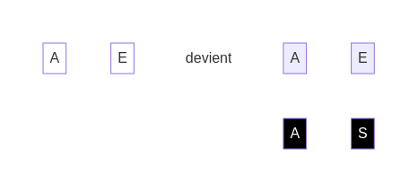
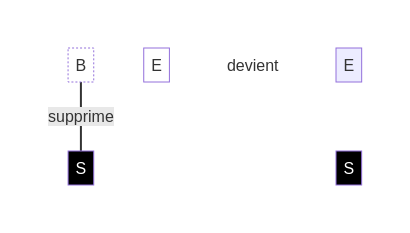

Tu préfères supprimer les bugs ? Utilise cette face des **dés noirs** :

* "S" - Supprimer : Retire le **dé blanc** et décale les dés suivants d'une position vers la gauche pour combler l'espace vide.  
    Voir en vidéo : http://youtu.be/xxxxxx   

Voici quelques **défis** pour tester cette action :

Solution

Solution

Si tu as un doute, voici un exemple :

L'action "S" - Supprimer te permet de retirer le **dé blanc** "B". Le **dé blanc** "E" est décalé pour prendre sa place :

[retour](./4)

[suivant](./6)

