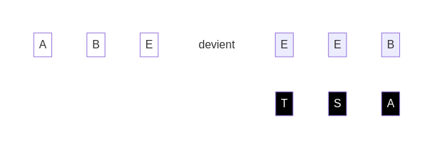
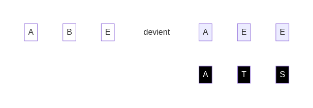
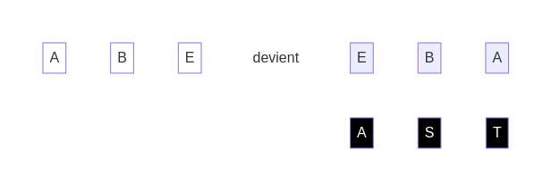

Choisir le chemin, c'est choisir la destination. Les décisions que tu prends dans le jeu, comme supprimer un dé ou en ajouter un, ont un impact direct sur le résultat final.

Solution

Solution

Solution

Solution

[retour](./6)

[suivant](./8)

