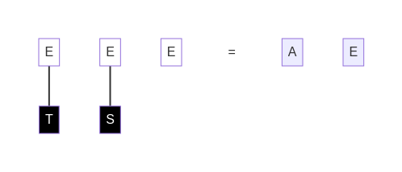
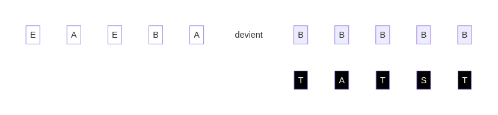
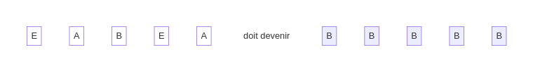
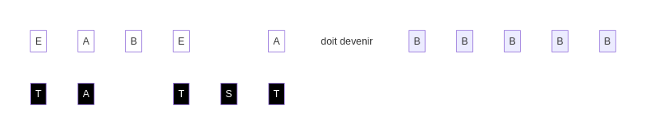

## Encore plus de défis

Mon travail avec toi se termine. Montre moi ce que tu as appris :

Solution

Solution

Bravo !

Souviens-toi toujours : la véritable avancée ne réside pas dans ce que tu as déjà accompli, mais dans les horizons que tu t'apprêtes à explorer.

[retour](./8)

[suivant](./10)

